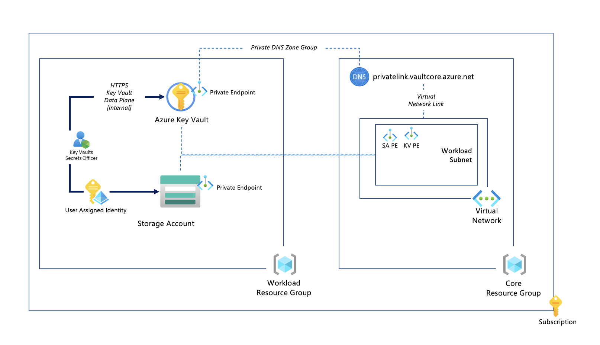

### Lab 01 - Demo: Deploying a Storage Account + Customer Managed Key Solution Using AVM modules published in the Public Bicep Registry

##### Architecture



#### Description

This architecture deploys the following:

#### Core Resource Group

Containing:

- Azure Virtual Network, with one subnet.
- Private DNS Zone for Azure Key Vault, and integrated into the Virtual Network.

### Workload Resource Group

Containing:

- Azure Key Vault, with public network access disabled, and uses the Azure RBAC authorization model. It also has a Private Endpoint deployed into the Virtual Network workload subnet, and also linked to the Private DNS Zone for Azure Key Vault.
- Storage Account, with public network access disabled, and uses the Customer Managed Key feature to protect the data at rest. It also has a Private Endpoint deployed into the Virtual Network workload subnet, and also linked to the Private DNS Zone for Azure Storage.

## Deployment

:hourglass_flowing_sand: **Average Solution End to End Deployment time**: 10 minutes

- Open a Visual Studio Code session, clone the repository and then open up a VS Code session in the folder for the cloned repo.

:warning: Ensure you are logged into Azure using the Azure CLI.

```shell
az login
az account set --subscription '<<your subscription name>>'
```

### Method (1) - `main.bicep` file

- Deploy the [main.bicep](main.bicep) by modifying the `identifier` parameter to something that is unique to your deployment (i.e. a 5 letter string). Additionally you can also change the `location` parameter to a different Azure region of your choice.

```powershell
az deployment sub create --location 'australiaeast' --name 'lab01' --template-file '<<path to the repo>>/labs/lab01/main.bicep' --verbose
```

### Method (2) - `main.parameters.json` file

- Deploy the [main.parameters.json](main.parameters.json) by modifying the `identifier` parameter to something that is unique to your deployment (i.e. a 5 letter string). Additionally you can also change the `location` parameter to a different Azure region of your choice.

```powershell
az deployment sub create --location 'australiaeast' --name 'lab01' --template-file '<<path to the repo>>/labs/lab01/main.bicep' --parameters '<<path to the repo>>/labs/lab01/main.parameters.json' --verbose
```

---
